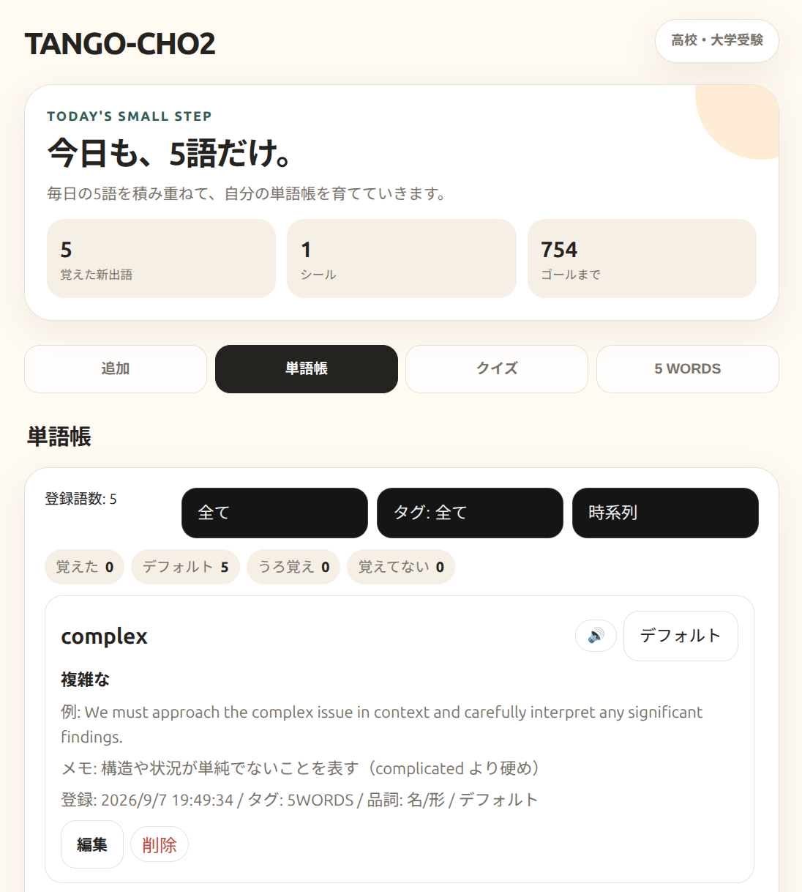

# TANGO-CHO2

  

  <strong>単語帳 × BYOK AI × 4択クイズ × DAILY 5 WORDS</strong> 
  毎日5語だけ積み重ねる、白く軽やかな英語学習PWA。

  <a href="https://masato-nasu.github.io/TANGO-CHO2/">▶ Live Demo</a>

---

## UI Preview

  

TANGO-CHOをベースに、従来の **Fortune(EN)** を廃止し、毎日5語をAIが選ぶ **5 WORDS** を語彙発見の入口として統合しました。

現在は **5 WORDSで生成された5語をすべて自動で単語帳へ登録**します。既登録語は重複させず、登録後に単語帳から削除した語を勝手に復活させることもありません。

---

## Concept

**見つける → 聞く → 自動登録 → 覚える → クイズで繰り返す**

毎日たくさん覚えるのではなく、**今日も、5語だけ。**

5語と、その5語すべてを使った1つの英文を生成し、単語帳・例文・復習までを1つの流れにまとめています。

---

## DAILY 5 WORDS

- AIが毎日5語を選択
- 既に単語帳へ登録している語は可能な限り避けて生成
- 生成された **5語すべてを自動で単語帳へ登録**
- 大文字・小文字の違いを含め、同じ単語は重複登録しない
- 新規登録語の学習状態は **デフォルト**
- 各単語を **🔊 発音確認**可能
- 5語すべてを自然に使った **ONE SENTENCE** を生成
- 日本語訳・短いメモも保存
- 同日の生成結果は端末内に保存
- 単語帳で削除した5 WORDS由来の単語は自動で復活しない

### English level

5 WORDSのレベルは3段階です。

- **中学生向き**
- **高校・大学受験**
- **大人 / TOEIC 800+**

画面右上のレベル表示も、選択中のEnglish levelに合わせて自動で変わります。

---

## Progress

5WORDSと同じ考え方で、上部に学習の積み上げを表示します。

- **覚えた新出語**
- **シール**
- **ゴールまで**

**ゴール日は固定日ではありません。最初に5 WORDSを始めた日を開始日として、その2年6か月後をゴールにします。**

開始日とゴール日は端末内に保存され、毎日の残り日数が自動で更新されます。

---

## 単語帳

保存した語には以下を持たせられます。

- 英単語
- 日本語訳
- 例文
- メモ
- 類義語
- タグ
- 品詞候補
- 学習状態
  - デフォルト
  - 覚えてない
  - うろ覚え
  - 覚えた

単語は個別に **編集 / 削除** できます。

---

## 例文の統一

同じ単語に対して例文がバラバラにならないように、例文を共有します。

- 5 WORDSから登録した語 → その日の **ONE SENTENCE**
- AI補完から作った語 → 最初に生成された例文

以後、同じ単語では保存済みの例文を再利用します。

---

## BYOK AI

利用者自身の **OpenAI APIキー** を使うBYOK方式です。

主なAI機能:

- DAILY 5 WORDS生成
- AI翻訳
- AI空欄補完
- 類義語取得
- 例文生成
- ニュアンスメモ生成

初期モデルは `gpt-5-mini` です。

APIキーはGitHubのソースコードには保存されず、単語帳のバックアップJSONにも含めません。

---

## 4択クイズ

保存した単語から4択クイズを作成します。

- 英 → 日
- 日 → 英
- 学習状態別
- ランダム出題
- 一巡するまで同じ語を繰り返しにくい出題デッキ

---

## その他の機能

- 発音読み上げ
- JSONエクスポート / インポート
- PWA対応
- iPhone / Android対応
- Princeton WordNetベースの品詞候補表示
- TANGO-CHO2専用ストレージ

---

## TANGO-CHOからの主な変更点

| TANGO-CHO | TANGO-CHO2 |
| --- | --- |
| Fortune(EN) | DAILY 5 WORDS |
| 英文占いから単語を拾う | AIが毎日5語を生成 |
| 必要な語を手動で追加 | 5語すべて自動登録 |
| 例文生成は各機能ごと | 同じ単語では例文を共有・再利用 |
| ダーク寄りUI | 5WORDSに寄せた白・アイボリー基調UI |
| 固定的な期間表示 | 開始日から2年6か月をゴールにする進捗表示 |
| TANGO-CHO用データ | TANGO-CHO2用データとして分離 |

元のTANGO-CHOは変更せず、TANGO-CHO2を独立したアプリとして運用しています。

---

## 使い方

### 1. AI設定

「追加」画面の **⚙️ AI設定（BYOK）** を開きます。

1. OpenAI APIキーを入力
2. モデルを確認
3. 接続テスト
4. 設定を保存

### 2. 5 WORDSを生成

**5 WORDS** タブでEnglish levelを選び、5語を生成します。

生成された5語は、既登録語を除いて単語帳へ自動登録されます。

### 3. 発音とONE SENTENCEを確認

各語の **🔊** で発音を確認し、5語をまとめて使ったONE SENTENCEで文脈も確認します。

### 4. 単語帳で整理

不要な語は削除できます。削除した語が5 WORDS画面を開いただけで再登録されることはありません。

### 5. クイズで復習

4択クイズで繰り返し確認します。

---

## PWAとしてインストール

### iPhone / iPad

SafariでLive Demoを開き、**共有 → ホーム画面に追加**。

### Android

ChromeでLive Demoを開き、**アプリをインストール** または **ホーム画面に追加**。

---

## データ保存

単語帳や5 WORDSの生成結果は、基本的に端末のブラウザストレージへ保存されます。

TANGO-CHO2は元のTANGO-CHOと同じ `github.io` ドメイン上で動作しても、主要な単語帳データをTANGO-CHO2側のキーへ分離して扱います。

初回のみ既存TANGO-CHOのデータがある場合はTANGO-CHO2へコピーし、その後は別々に管理します。

---

## Privacy

- 単語帳データは基本的に端末内へ保存
- AI機能を使ったときだけ必要なテキストをOpenAI APIへ送信
- OpenAI APIキーはGitHubへ保存しない
- APIキーは単語帳バックアップJSONに含めない

---

## Third-party licenses

### Princeton WordNet

本アプリはPrinceton WordNetのデータに基づく品詞ワードリストを同梱しています。

WordNet License / Terms of Use  
https://wordnet.princeton.edu/license-and-commercial-use

同梱ライセンス: [`data/WORDNET_LICENSE.txt`](data/WORDNET_LICENSE.txt)

---

## Current highlights

- 5WORDS風の白・アイボリーUI
- DAILY 5 WORDS
- 5語すべて自動登録
- 重複登録防止
- 発音ボタン
- ONE SENTENCE共有
- 開始日から **2年6か月** の進捗表示
- English level連動表示
- 削除した語を勝手に復活させない
- かわいいTANGO-CHO2専用アイコン

---

**TANGO-CHO2**  
毎日5語だけ。2年半かけて単語帳を少しずつ育てるためのPWA。
