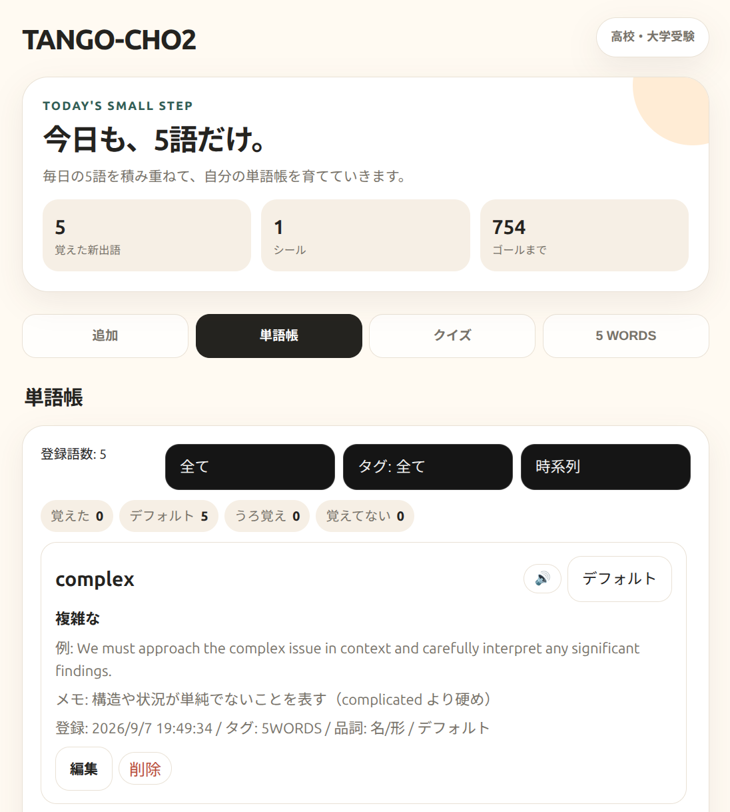

# TANGO-CHO2

  

  <strong>単語帳 × BYOK AI × 4択クイズ × 5 WORDS</strong> 
  好きなときに5語を発見し、PART 5で練習する英語学習PWA。

  <a href="https://masato-nasu.github.io/TANGO-CHO2/">▶ Live Demo</a>

---

## UI Preview

  

TANGO-CHOをベースに、従来の **Fortune(EN)** を廃止し、5語をAIが選ぶ **5 WORDS** を語彙発見の入口として統合しました。

現在は **5 WORDSで生成された5語をすべて自動で単語帳へ登録**します。既登録語は重複させず、登録後に単語帳から削除した語を勝手に復活させることもありません。

---

## Concept

**見つける → 聞く → 自動登録 → 覚える → クイズで繰り返す**

**好きなときに、何度でも5語ずつ。**

5語と、その5語すべてを使った1つの英文を生成し、単語帳・例文・復習までを1つの流れにまとめています。

---

## 5 WORDS

- AIが1セット5語を選択。日付・回数の制限なし
- 既に単語帳へ登録している語は可能な限り避けて生成
- 生成された **5語すべてを自動で単語帳へ登録**
- 大文字・小文字の違いを含め、同じ単語は重複登録しない
- 新規登録語の学習状態は **デフォルト**
- 各単語を **🔊 発音確認**可能
- 5語すべてを自然に使った **ONE SENTENCE** を生成
- 日本語訳・短いメモも保存
- 生成セットごとに端末内へ保存。前回のセットを再表示
- 単語帳で削除した5 WORDS由来の単語は自動で復活しない

### English level

5 WORDSのレベルは3段階です。

- **中学生向き**
- **高校・大学受験**
- **大人 / TOEIC 800+**

画面右上のレベル表示も、選択中のEnglish levelに合わせて自動で変わります。

---

## Progress

上部に生成した語数、生成セット数、単語帳の登録語数を表示します。
日付による生成制限や、日ごとのセット切り替えはありません。過去の生成セットも引き継ぎます。

---

## 単語帳

保存した語には以下を持たせられます。

- 英単語
- 日本語訳
- 例文
- メモ
- 類義語
- タグ
- 品詞候補
- 学習状態
  - デフォルト
  - 覚えてない
  - うろ覚え
  - 覚えた

単語は個別に **編集 / 削除** できます。

---

## 例文の統一

同じ単語に対して例文がバラバラにならないように、例文を共有します。

- 5 WORDSから登録した語 → 生成セットの **ONE SENTENCE**
- AI補完から作った語 → 最初に生成された例文

以後、同じ単語では保存済みの例文を再利用します。

---

## BYOK AI

利用者自身の **OpenAI APIキー** を使うBYOK方式です。

主なAI機能:

- 5 WORDS生成
- AI翻訳
- AI空欄補完
- 類義語取得
- 例文生成
- ニュアンスメモ生成

初期モデルは `gpt-5-mini` です。

APIキーはGitHubのソースコードには保存されず、単語帳のバックアップJSONにも含めません。

---

## 4択クイズ

保存した単語から4択クイズを作成します。

- 英 → 日
- 日 → 英
- 学習状態別
- ランダム出題
- 一巡するまで同じ語を繰り返しにくい出題デッキ

---

## PART 5

登録済みの単語と意味を使い、英文穴埋め4択を練習します。

- **VOCAB**: 文脈に合う登録語を選ぶ
- **WORD FORM**: 登録語の語族から文法に合う語形を選ぶ
- **MIX**: 両タイプを交互に出題
- 5語 / 10語 / 30語。日単位の制限なし
- 「覚えてない」「うろ覚え」の優先を切り替え可能
- 正答率、回答時間、各回答、練習結果を端末内に記録し、苦手語を表示
- PART 5の結果で単語帳の学習状態を自動変更しない

初回の問題作成には既存のBYOK AI設定が必要です。検証した問題を端末内に保存し、次回以降・オフライン時には再利用します。AI生成のため問題の内容に誤りが残る可能性があります。4択の語族を作れない登録語は、VOCABで練習できます。
登録語が選択語数より少ない場合は、繰り返しを含めて指定した問題数を練習します。
PART 5の成績と問題キャッシュは単語帳とは別のTANGO-CHO2専用キーに保存します。成績は新しいJSONバックアップに含まれます。問題キャッシュは含めません。

---

## その他の機能

- 発音読み上げ
- JSONエクスポート / インポート
- PWA対応
- iPhone / Android対応
- Princeton WordNetベースの品詞候補表示
- TANGO-CHO2専用ストレージ

---

## TANGO-CHOからの主な変更点

| TANGO-CHO | TANGO-CHO2 |
| --- | --- |
| Fortune(EN) | 5 WORDS |
| 英文占いから単語を拾う | AIが好きなときに5語を生成 |
| 必要な語を手動で追加 | 5語すべて自動登録 |
| 例文生成は各機能ごと | 同じ単語では例文を共有・再利用 |
| ダーク寄りUI | 5WORDSに寄せた白・アイボリー基調UI |
| 固定的な期間表示 | 生成語・生成セット・登録語の集計 |
| TANGO-CHO用データ | TANGO-CHO2用データとして分離 |

元のTANGO-CHOは変更せず、TANGO-CHO2を独立したアプリとして運用しています。

---

## 使い方

### 1. AI設定

「追加」画面の **⚙️ AI設定（BYOK）** を開きます。

1. OpenAI APIキーを入力
2. モデルを確認
3. 接続テスト
4. 設定を保存

### 2. 5 WORDSを生成

**5 WORDS** タブでEnglish levelを選び、5語を生成します。

生成された5語は、既登録語を除いて単語帳へ自動登録されます。

### 3. 発音とONE SENTENCEを確認

各語の **🔊** で発音を確認し、5語をまとめて使ったONE SENTENCEで文脈も確認します。

### 4. 単語帳で整理

不要な語は削除できます。削除した語が5 WORDS画面を開いただけで再登録されることはありません。

### 5. クイズで復習

4択クイズで繰り返し確認します。

---

## PWAとしてインストール

### iPhone / iPad

SafariでLive Demoを開き、**共有 → ホーム画面に追加**。

### Android

ChromeでLive Demoを開き、**アプリをインストール** または **ホーム画面に追加**。

---

## 自動バックアップ

単語帳・PART 5成績・通常クイズの学習履歴を、TANGO-CHO2専用のIndexedDBに直近5世代だけ自動保存します。同じ内容は重複保存せず、古い世代を順に入れ替えます。ファイルの自動ダウンロードは行いません。

- 「⚙️ AI設定（BYOK）」内で、保存日時と語数を見て世代を手動復元
- 「JSONを書き出す」で必要なときだけ1ファイルを書き出す
- 「JSONを読み込む」で手動復元。古い単語帳JSON・配列も読み込み可能
- 古い単語帳だけのJSONを読む場合は、PART 5成績を維持
- 復元前のデータを退避し、復元後に画面を再読み込み
- APIキー・AI設定・問題キャッシュはバックアップに含めない

端末内の世代保存は、ブラウザのサイトデータ消去に対する外部バックアップにはなりません。別端末へ移す場合や外部へ退避する場合にはJSONを書き出してください。

---

## データ保存

単語帳や5 WORDSの生成結果は、基本的に端末のブラウザストレージへ保存されます。

TANGO-CHO2は元のTANGO-CHOと同じ `github.io` ドメイン上で動作しても、主要な単語帳データをTANGO-CHO2側のキーへ分離して扱います。

初回のみ既存TANGO-CHOのデータがある場合はTANGO-CHO2へコピーし、その後は別々に管理します。

---

## Privacy

- 単語帳データは基本的に端末内へ保存
- AI機能を使ったときだけ必要なテキストをOpenAI APIへ送信
- OpenAI APIキーはGitHubへ保存しない
- APIキーは単語帳バックアップJSONに含めない

---

## Third-party licenses

### Princeton WordNet

本アプリはPrinceton WordNetのデータに基づく品詞ワードリストを同梱しています。

WordNet License / Terms of Use  
https://wordnet.princeton.edu/license-and-commercial-use

同梱ライセンス: [`data/WORDNET_LICENSE.txt`](data/WORDNET_LICENSE.txt)

---

## Current highlights

- 5WORDS風の白・アイボリーUI
- 5 WORDS
- 5語すべて自動登録
- 重複登録防止
- 発音ボタン
- ONE SENTENCE共有
- 生成語・生成セット・登録語の集計
- English level連動表示
- 削除した語を勝手に復活させない
- かわいいTANGO-CHO2専用アイコン

---

**TANGO-CHO2**  
5語の発見とPART 5の練習で、単語帳を育てるPWA。
